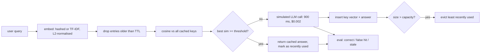

# AI Learn 20 — Semantic Cache from Scratch

Build a **semantic cache** for an LLM app: instead of caching answers by exact query string, cache them by *embedding similarity*, so "can I cancel an order I just placed" reuses the answer to "how do I cancel my order". The catch is that "how do I **track** my order" is lexically close too, and serving the cancel answer for it is a **false hit** (a wrong answer). This project sweeps the similarity threshold to measure that trade-off, adds LRU and TTL eviction, and estimates latency/cost savings.

Everything is NumPy and the standard library. There are no models, no LLM APIs and no network. The "LLM" is an oracle stub with a simulated latency and cost per call.

## What you'll learn

- How a semantic cache works: embed → nearest cached key → return its answer if cosine ≥ threshold, otherwise call the LLM and insert
- Two offline embedders: **signed feature hashing** (word + bigram + char-3-gram) and **TF-IDF**, and how to compare them with pair-level AUC
- Why the right metric is **hit rate subject to a false-hit cap**, and how hard negatives (sibling intents that share words) drive false hits
- **LRU capacity** and **TTL** eviction, and how TTL bounds *stale* answers after the underlying answer changes
- How to account for simulated latency/cost savings against an exact-match baseline

## Architecture



Evaluation has three views:

1. **Pairs**: 160 paraphrase and 160 non-paraphrase pairs (half of them hard: same family, e.g. cancel vs return an order). This gives an AUC per embedder.
2. **Probe set**: the cache holds the canonical question for 8 of 16 intents. All 64 paraphrases are probed; 32 should hit and 32 should miss (every uncached intent has a similar cached sibling). This gives hit rate vs false-hit rate per threshold.
3. **Stream**: 2000 Zipf-distributed queries, with the cache filled on each miss. This gives hit rate, false hits, LLM calls saved, and simulated latency, plus the LRU capacity and TTL sweeps (with answers for 4 intents changing at t=1000).

## Layout

```
data.py          # 16 intents x (canonical + 4 paraphrases + answer), pairs, probe set, Zipf stream
embed.py         # HashedEmbedder (signed feature hashing) and TfidfEmbedder
cache.py         # SemanticCache: threshold lookup, LRU capacity, TTL expiry, stats
simulate.py      # probe_eval, stream replay with simulated LLM latency/cost, exact-match baseline, AUC
smoke_plots.py   # matplotlib SVG plots + RESULTS.md
svg_utils.py     # small SVG minifier (keeps plots text-friendly)
run_smoke.py     # pairs -> probe sweep -> stream sweep -> eviction -> results/
notebooks/semantic_cache.ipynb
results/         # committed RESULTS.md, metrics.json, JSON.shot, *.svg
```

## Run

```bash
python -m venv .venv && source .venv/bin/activate
pip install -r requirements.txt
python run_smoke.py
```

Runs on CPU in a few seconds with seed 42. See `results/RESULTS.md` for the latest smoke metrics.

## Caveats

- The latency and cost figures are simulated with a fixed 900 ms and $0.002 per LLM call. Only the cache lookup time is measured.
- The query set is small and synthetic (80 distinct strings), so an exact-match cache already catches most repeats in the stream. The probe set is the fairer test of semantic matching.

## What you'll learn next

Post-training quantization (`ai-learn-21`), knowledge distillation (`ai-learn-22`), DPO preference tuning (`ai-learn-23`), and mixture-of-experts (`ai-learn-24`).
