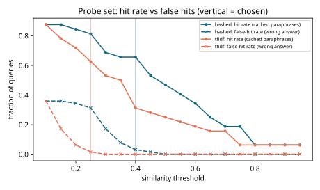
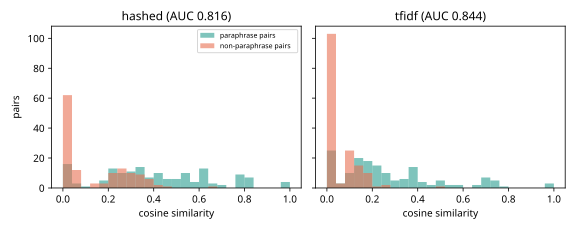
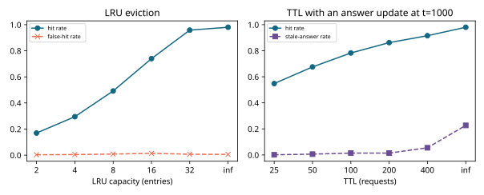
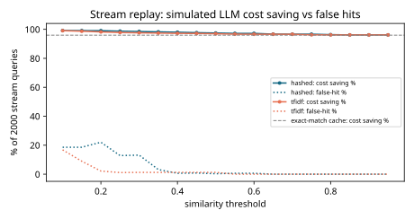

# Results -- ai-learn-20-semantic-cache

**Seed:** `42` | 16 intents | stream = 2000 Zipf(a=1.1) queries | pairs: 160 paraphrase / 160 non-paraphrase | simulated LLM call = 900 ms, $0.002

## Pair-level separability

| Embedder | AUC | mean sim (paraphrase) | mean sim (non-paraphrase) |
|---|---:|---:|---:|
| hashed | 0.8158 | 0.3903 | 0.1039 |
| tfidf | 0.8442 | 0.2742 | 0.0477 |

## Probe set: hit rate vs wrong answers

Cache holds the canonical question of 8 intents; probes are the 64 paraphrases of all 16 intents (32 should hit, 32 should miss; every uncached intent has a lexically similar cached sibling).

Chosen threshold = max hit rate with false-hit rate <= 0.05:

| Embedder | threshold | hit rate | false-hit rate (all probes) | false-hit rate (uncached probes) | wrong answers among hits |
|---|---:|---:|---:|---:|---:|
| hashed | 0.40 | 0.6562 | 0.0312 | 0.0625 | 0.0870 |
| tfidf | 0.25 | 0.6250 | 0.0156 | 0.0312 | 0.0476 |

| threshold | hashed hit / false-hit | tfidf hit / false-hit |
|---:|---:|---:|
| 0.10 | 0.875 / 0.359 | 0.875 / 0.359 |
| 0.15 | 0.875 / 0.359 | 0.781 / 0.172 |
| 0.20 | 0.844 / 0.344 | 0.719 / 0.062 |
| 0.25 | 0.812 / 0.312 | 0.625 / 0.016 |
| 0.30 | 0.688 / 0.172 | 0.531 / 0.000 |
| 0.35 | 0.656 / 0.078 | 0.500 / 0.000 |
| 0.40 | 0.656 / 0.031 | 0.312 / 0.000 |
| 0.45 | 0.531 / 0.016 | 0.281 / 0.000 |
| 0.50 | 0.469 / 0.000 | 0.250 / 0.000 |
| 0.55 | 0.406 / 0.000 | 0.219 / 0.000 |
| 0.60 | 0.344 / 0.000 | 0.188 / 0.000 |
| 0.65 | 0.250 / 0.000 | 0.156 / 0.000 |
| 0.70 | 0.188 / 0.000 | 0.156 / 0.000 |
| 0.75 | 0.188 / 0.000 | 0.062 / 0.000 |
| 0.80 | 0.062 / 0.000 | 0.062 / 0.000 |
| 0.85 | 0.062 / 0.000 | 0.062 / 0.000 |
| 0.90 | 0.062 / 0.000 | 0.062 / 0.000 |
| 0.95 | 0.062 / 0.000 | 0.062 / 0.000 |

## Stream replay at the chosen threshold (2000 Zipf queries, cache filled on miss)

Exact-string cache baseline hit rate: **0.9600**.

| Embedder | threshold | hit rate | false-hit rate | LLM calls | cost saving | mean latency (ms) | lookup (ms, measured) |
|---|---:|---:|---:|---:|---:|---:|---:|
| hashed | 0.40 | 0.9805 | 0.0060 | 39 | 98.0% | 17.6 vs 900 | 0.044 |
| tfidf | 0.25 | 0.9780 | 0.0110 | 44 | 97.8% | 19.8 vs 900 | 0.024 |

## Eviction (hashed @ threshold 0.40)

| LRU capacity | hit rate | false-hit rate | evicted |
|---:|---:|---:|---:|
| 2 | 0.1695 | 0.0025 | 1659 |
| 4 | 0.2945 | 0.0045 | 1407 |
| 8 | 0.4920 | 0.0080 | 1008 |
| 16 | 0.7395 | 0.0135 | 505 |
| 32 | 0.9585 | 0.0070 | 51 |
| inf | 0.9805 | 0.0060 | 0 |

Answers for billing_refund, shipping_cost, store_hours, order_return change at t=1000; a hit that returns the old version is *stale*.

| TTL | hit rate | stale rate | wrong-answer rate (false + stale) | expired |
|---:|---:|---:|---:|---:|
| 25 | 0.5480 | 0.0010 | 0.0120 | 895 |
| 50 | 0.6755 | 0.0060 | 0.0205 | 633 |
| 100 | 0.7830 | 0.0140 | 0.0285 | 413 |
| 200 | 0.8625 | 0.0140 | 0.0280 | 243 |
| 400 | 0.9155 | 0.0550 | 0.0685 | 137 |
| inf | 0.9805 | 0.2270 | 0.2330 | 0 |

## Takeaways

- Best setting: **hashed @ 0.40** answers 65.6% of cached-intent paraphrases with a probe false-hit rate of 3.1%. On the stream it hits 98.0% of queries (exact match: 96.0%), cutting simulated LLM cost by 98.0%.
- Lower thresholds raise the hit rate but start returning answers for the *wrong* intent (cancel vs track vs return an order). The false-hit rate is the metric to cap, not the hit rate to maximise.
- The stream only has 80 distinct strings, so an exact-match cache already hits most repeats; the semantic cache's extra value is the paraphrase hits it adds on top, paid for with a small false-hit rate.
- Latency and cost numbers are simulated (fixed per-call LLM latency/cost); cache lookup time is measured.

## Plots

Wall time: 3.97s on CPU.
